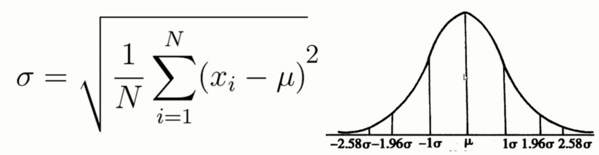
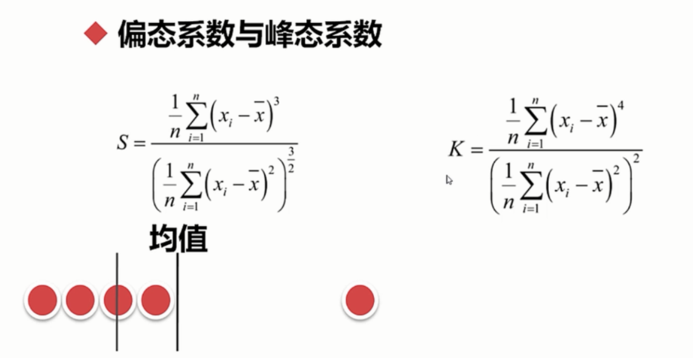
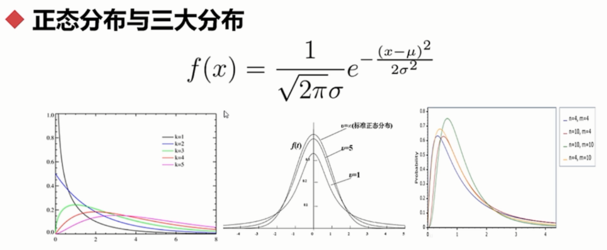
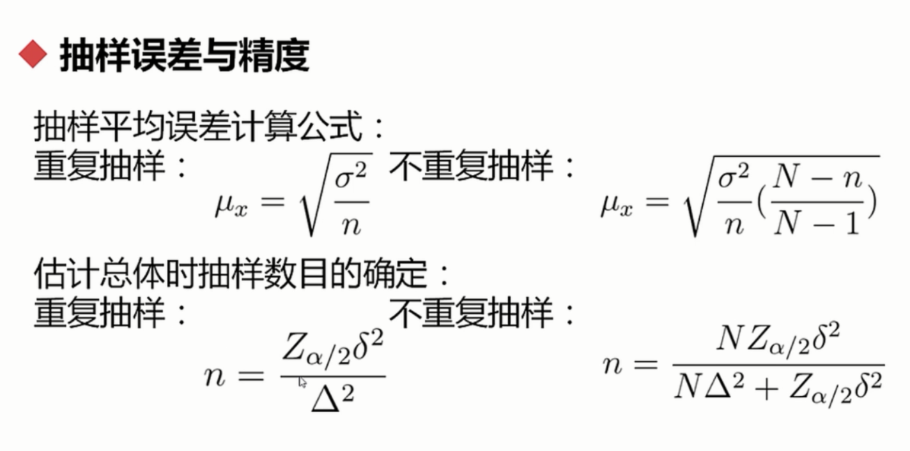
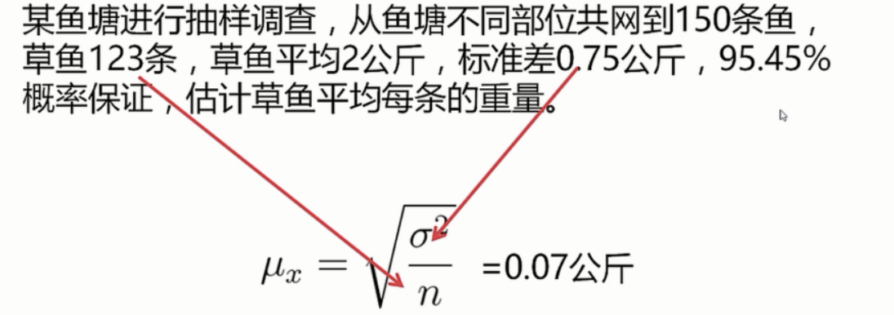
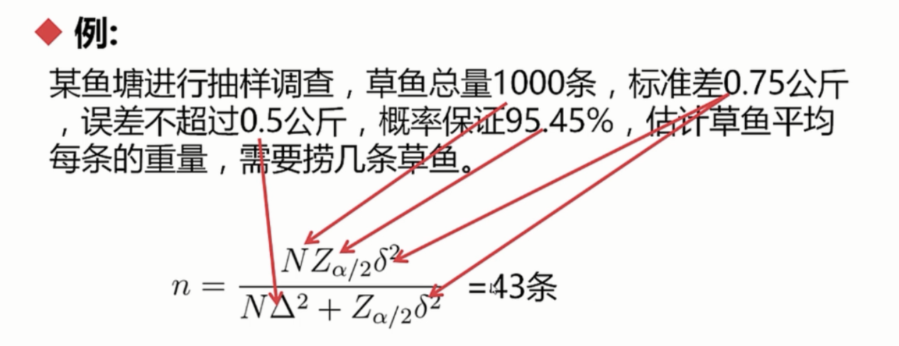
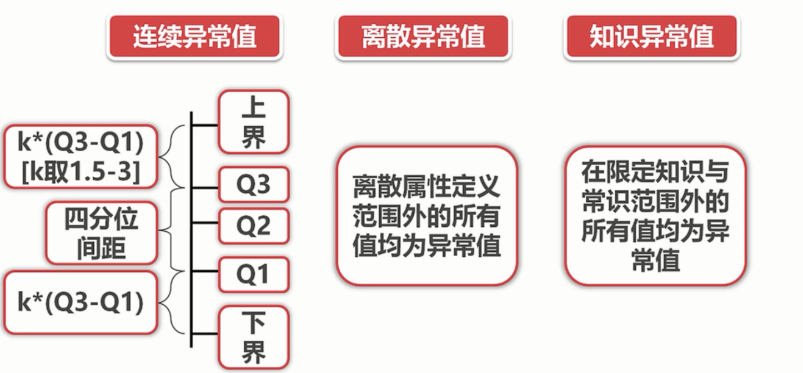

## 探索性数据分析

### 单因子与对比分析可视化

#### 基本概念

​	**集中趋势**：均值、中位数、众数、分位数。

​	四分位数计算方法(n代表数据的数量)

​	Q1的位置 = (n+1) * 0.25

​	Q2 = (n+1) * 0.5

​	Q3 = (n+1) * 0.75

​	**离中趋势：**标准差，方差（越大越离散，越小越聚拢）

​	

​	**偏态与封度：**（均值对于中位数的偏差）

​	

​	偏态：平均数相对于中位数的偏大还是偏小

​	峰态：分布顶峰的值，一般认为是3。如果一个分布峰态系数大于了5或者小于了1，一般人为他不是正太分布，常用来判断是否是正态分布。

​	三大分布没太懂...（卡方，t,f）

**抽样理论：**

​	抽样误差和精度：

​	

​	N:总体数量，n：抽样数量

​	Z:2.58啥的，那个标准...（96.45%：2,99%：》=2.58 ）

​	Δ：控制方差（比如误差啥的）

​	δ：标准差

 例1：答案（平均重量1.86-2.14公斤）

​	

​	例2：

​	

### 数据分类

* 定类（类别）：根据事物离散、无差别属性进行的分类；
* 定序(顺序)：可以界定数据的大小，但不能测定差值。
* 定距（间隔）：可以界定数据大小的同时，可测定差值，但无绝对零点。
* 定比（比率）：可以界定数据大小，可测定差值，有绝对零点。

#### 异常值分析

#### 对比分析

​	绝对数比较

​	相对数比较（几个数联合构成新的）

* 结构相对数：各种率

* 比例相对数：传统什么行业的比率

* 比较相对数：不同互联网公司待遇水平

* 动态相对数：有时间概念

* 强度相对数：人均啥的

  怎么比？

  时间，空间，经验与计划。

#### 结构分析（研究部分总体关系）

​	**静态：**分析整体的组成。

​	**动态:**根据时间来分析

#### 分布分析

​	**直接获得概率分布**

​	**是不是正态分布**

​	**极大似然**：存在一个均值和方差，一些数使其的值最大。